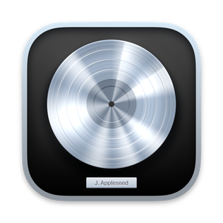

<div align="center">

# Seowon Yi

**Computer Science & Information Engineering**<br>
Kunsan National University

"I hate Claude Code"

[](mailto:leeseowon@gmail.com)

</div>

## Focus

```text
Image/Video/Vocal Synthesis  ·  Image Processing  ·  Swift Programming
```

## Selected work

| Project | Description |
| --- | --- |
| [Plany](https://github.com/yiseowon/Plany) | A collaborative web app for organizing travel schedules, places, expenses, and checklists. |
| [unifying-storage](https://github.com/yiseowon/unifying-storage) | A lightweight project hub that turns a spare Mac into a shared file server. |
| [ClipLock](https://github.com/yiseowon/ClipLock) | A native macOS menu bar app that protects important clipboard content from accidental replacement. |

## Tools


<table>
  <tr>
    <td align="center" width="180">
      <a href="https://dreamtonics.com/synthesizerv/">
        <br>
        <sub><b>Synthesizer V</b></sub>
      </a>
    </td>
    <td align="center" width="180">
      <a href="https://www.vocaloid.com/en/vocaloid6/">
        <picture>
          <source media="(prefers-color-scheme: dark)" srcset="assets/vocaloid6-light.png">
          
        </picture><br>
        <sub><b>VOCALOID6</b></sub>
      </a>
    </td>
    <td align="center" width="180">
      <a href="https://www.apple.com/logic-pro/">
        <br>
        <sub><b>Logic Pro</b></sub>
      </a>
    </td>
  </tr>
</table>

<sub>Currently interested in native macOS utilities and expressive media technology.</sub>
